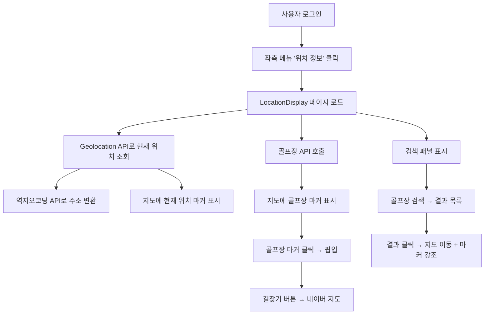
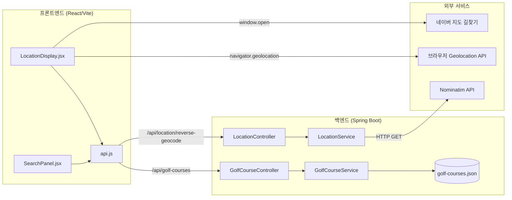

# 설계 문서: 위치 정보 표시 (location-display)

## 개요

이 기능은 로그인한 사용자가 브라우저 Geolocation API를 통해 현재 위치를 조회하고, react-leaflet 지도 위에 표시하며, Nominatim 역지오코딩으로 주소를 변환하여 보여주는 기능이다. 추가로 Kakao 로컬 API로 수집한 전국 골프장 데이터를 JSON 파일로 관리하고, 지도에 유형별 색상 마커로 표시한다. 검색 패널을 통해 골프장을 이름/지역으로 검색하고, 네이버 길찾기와 연동하여 경로 안내를 제공한다.

### 주요 기능 흐름



## 아키텍처

### 시스템 구성도



### 기술 스택

| 계층 | 기술 | 용도 |
|------|------|------|
| 프론트엔드 | React 18 + Vite | SPA 프레임워크 |
| 지도 | react-leaflet + leaflet | 지도 렌더링 및 마커 표시 |
| 위치 조회 | Browser Geolocation API | 사용자 현재 위치 좌표 조회 |
| 역지오코딩 | Nominatim (OpenStreetMap) | 좌표 → 주소 변환 |
| 백엔드 | Spring Boot 3.4.4 + Java 17 | REST API 서버 |
| 데이터 | JSON 파일 (정적) | 골프장 데이터 저장 |
| 데이터 수집 | Node.js 스크립트 + Kakao 로컬 API | 골프장 데이터 수집 |
| 길찾기 | 네이버 지도 URL | 경로 안내 연동 |
| 인증 | HttpSession (JSESSIONID) | 세션 기반 인증 |


### 설계 결정 사항

1. **골프장 데이터를 DB가 아닌 JSON 파일로 관리**: 골프장 데이터는 변경 빈도가 낮고, 수집 스크립트로 1회성 생성 후 정적으로 사용한다. DB 테이블 추가 없이 `@PostConstruct`로 메모리에 로드하여 빠른 조회를 제공한다.
2. **Nominatim 역지오코딩 사용**: 무료이며 API 키 불필요. 사용 빈도가 낮아(사용자 위치 조회 시 1회) rate limit 문제가 없다.
3. **react-leaflet 사용**: 오픈소스 지도 라이브러리로 API 키 없이 사용 가능. OpenStreetMap 타일을 기본 제공한다.
4. **네이버 길찾기 URL 연동**: 별도 API 키 없이 URL 파라미터만으로 길찾기 페이지를 열 수 있다.
5. **검색 패널을 지도 위 오버레이로 배치**: 지도 영역을 최대한 활용하면서 검색 기능을 제공한다.

## 컴포넌트 및 인터페이스

### 백엔드 컴포넌트

#### 1. GolfCourse (POJO)

패키지: `com.medialog.biz.golf`

```java
@Getter
@Setter
@ToString(includeFieldNames = true)
public class GolfCourse {
    private String name;       // 골프장 이름
    private double latitude;   // 위도
    private double longitude;  // 경도
    private String address;    // 주소
    private String region;     // 지역 (예: 경기, 강원, 제주)
    private String type;       // 유형: "회원제", "퍼블릭", "회원제+퍼블릭"
}
```

#### 2. GolfCourseService

패키지: `com.medialog.biz.golf`

| 메서드 | 설명 |
|--------|------|
| `@PostConstruct init()` | `golf-courses.json` 파일을 읽어 `List<GolfCourse>`로 메모리에 로드 |
| `List<GolfCourse> retrieveAll()` | 전체 골프장 목록 반환 |
| `List<GolfCourse> searchByKeyword(String keyword)` | 이름 또는 지역에 키워드가 포함된 골프장 목록 반환. 빈 키워드 시 전체 반환 |

#### 3. GolfCourseController

패키지: `com.medialog.biz.golf`

| 엔드포인트 | 메서드 | 설명 |
|-----------|--------|------|
| `GET /api/golf-courses` | `retrieveAll()` | 전체 골프장 목록 JSON 배열 반환 |
| `GET /api/golf-courses/search?keyword={keyword}` | `searchByKeyword()` | 키워드 검색 결과 JSON 배열 반환 |

세션 인증: `HttpSession`에서 `loginEmail` 속성 확인. 미인증 시 HTTP 401 반환.

#### 4. LocationService

패키지: `com.medialog.biz.golf`

| 메서드 | 설명 |
|--------|------|
| `String reverseGeocode(double latitude, double longitude)` | Nominatim API 호출하여 좌표를 주소 문자열로 변환. 실패 시 빈 문자열 반환 |

Nominatim API 호출 URL: `https://nominatim.openstreetmap.org/reverse?format=json&lat={lat}&lon={lng}&accept-language=ko`

`RestTemplate`을 사용하며, User-Agent 헤더를 설정한다 (Nominatim 정책 준수).

#### 5. LocationController

패키지: `com.medialog.biz.golf`

| 엔드포인트 | 메서드 | 설명 |
|-----------|--------|------|
| `GET /api/location/reverse-geocode?lat={lat}&lng={lng}` | `reverseGeocode()` | 주소 문자열을 `{"address": "..."}` JSON으로 반환 |

세션 인증: `HttpSession`에서 `loginEmail` 속성 확인. 미인증 시 HTTP 401 반환.


### 프론트엔드 컴포넌트

#### 1. LocationDisplay.jsx

경로: `frontend/src/pages/golf/LocationDisplay.jsx`

**상태 관리:**

| 상태 | 타입 | 설명 |
|------|------|------|
| `position` | `{lat, lng}` | 현재 위치 좌표 |
| `address` | `string` | 역지오코딩 주소 |
| `loading` | `boolean` | 위치 조회 중 여부 |
| `error` | `string` | 에러 메시지 |
| `golfCourses` | `array` | 골프장 목록 |
| `selectedCourse` | `object` | 검색 패널에서 선택된 골프장 |

**주요 동작:**
- 페이지 로드 시 `navigator.geolocation.getCurrentPosition()` 호출
- 좌표 획득 후 `reverseGeocode()` API 호출
- 골프장 API 호출하여 마커 표시
- "위치 새로고침" 버튼으로 위치 재조회

#### 2. SearchPanel.jsx

경로: `frontend/src/pages/golf/SearchPanel.jsx`

**Props:**

| Prop | 타입 | 설명 |
|------|------|------|
| `golfCourses` | `array` | 전체 골프장 목록 |
| `onSelectCourse` | `function` | 골프장 선택 시 콜백 |

**상태 관리:**

| 상태 | 타입 | 설명 |
|------|------|------|
| `keyword` | `string` | 검색어 |
| `searchResults` | `array` | 검색 결과 목록 |

**주요 동작:**
- 검색어 입력 시 `searchGolfCourses(keyword)` API 호출
- 빈 검색어 시 전체 목록 표시
- 결과 항목 클릭 시 `onSelectCourse` 콜백 호출
- 하단에 마커 색상 범례 표시

### API 함수 (api.js 추가분)

```javascript
export async function fetchGolfCourses() { /* GET /api/golf-courses */ }
export async function searchGolfCourses(keyword) { /* GET /api/golf-courses/search?keyword={keyword} */ }
export async function reverseGeocode(lat, lng) { /* GET /api/location/reverse-geocode?lat={lat}&lng={lng} */ }
```

### 라우트 및 메뉴 연동

- `LeftMenu.jsx`: "위치관리" 메뉴 그룹 추가 (아이콘: 📍), 하위 "위치 정보" → `/location/display`
- `App.jsx`: `/location/display` 라우트 추가 (`ProtectedRoute` 래핑)
- `PAGE_TITLES`: `/location/display` → `'위치 정보'`

## 데이터 모델

### 골프장 데이터 (golf-courses.json)

```json
[
  {
    "name": "골프장 이름",
    "latitude": 37.5665,
    "longitude": 126.9780,
    "address": "서울특별시 중구 ...",
    "region": "서울",
    "type": "퍼블릭"
  }
]
```

**유형(type) 값:**
- `"회원제"` — 회원제 골프장
- `"퍼블릭"` — 퍼블릭(대중) 골프장
- `"회원제+퍼블릭"` — 회원제와 퍼블릭 모두 운영


### 역지오코딩 응답

**요청:** `GET /api/location/reverse-geocode?lat=37.5665&lng=126.9780`

**응답:**
```json
{
  "address": "서울특별시 중구 세종대로 110"
}
```

**실패 시:**
```json
{
  "address": ""
}
```

### 골프장 API 응답

**전체 조회:** `GET /api/golf-courses`

**검색:** `GET /api/golf-courses/search?keyword=제주`

**응답 형식:** `GolfCourse` 객체의 JSON 배열 (위 golf-courses.json과 동일 구조)

### 골프장 마커 색상 매핑

| 유형 | 마커 색상 | Leaflet 색상 코드 |
|------|----------|------------------|
| 회원제 | 파란색 | `blue` |
| 퍼블릭 | 초록색 | `green` |
| 회원제+퍼블릭 | 오렌지색 | `orange` |

### 네이버 길찾기 URL 형식

```
https://map.naver.com/p/directions/{출발위도},{출발경도},{도착위도},{도착경도}/-/car
```

예시: `https://map.naver.com/p/directions/37.5665,126.9780,33.4996,126.5312/-/car`

## 정확성 속성 (Correctness Properties)

*속성(property)이란 시스템의 모든 유효한 실행에서 참이어야 하는 특성 또는 동작이다. 속성은 사람이 읽을 수 있는 명세와 기계가 검증할 수 있는 정확성 보장 사이의 다리 역할을 한다.*

### Property 1: 역지오코딩 API 응답 형식

*임의의* 유효한 위도(-90~90)와 경도(-180~180) 쌍에 대해, `LocationService.reverseGeocode(lat, lng)` 호출 결과는 항상 null이 아닌 문자열을 반환해야 한다 (성공 시 주소 문자열, 실패 시 빈 문자열).

**Validates: Requirements 3.3**

### Property 2: 미인증 요청 시 401 반환

*임의의* API 엔드포인트(`/api/golf-courses`, `/api/golf-courses/search`, `/api/location/reverse-geocode`)에 대해, 세션에 `loginEmail` 속성이 없는 요청은 항상 HTTP 401 상태 코드를 반환해야 한다.

**Validates: Requirements 6.2**

### Property 3: 골프장 유형별 마커 색상 매핑

*임의의* 골프장 유형 값에 대해, 마커 색상 매핑 함수는 다음을 만족해야 한다: `"회원제"` → `blue`, `"퍼블릭"` → `green`, `"회원제+퍼블릭"` → `orange`. 정의되지 않은 유형에 대해서는 기본 색상을 반환해야 한다.

**Validates: Requirements 7.3, 7.4, 7.5**

### Property 4: 골프장 JSON 직렬화 라운드트립

*임의의* 유효한 `GolfCourse` 객체에 대해, JSON으로 직렬화한 후 다시 역직렬화하면 원본 객체와 동일한 값(name, latitude, longitude, address, region, type)을 가져야 한다.

**Validates: Requirements 7.6, 7.7**

### Property 5: 키워드 검색 필터링

*임의의* 키워드 문자열과 골프장 목록에 대해, `GolfCourseService.searchByKeyword(keyword)` 결과의 모든 골프장은 이름 또는 지역에 해당 키워드를 포함해야 한다. 빈 키워드의 경우 전체 목록을 반환해야 한다.

**Validates: Requirements 8.5, 8.8**

### Property 6: 네이버 길찾기 URL 생성

*임의의* 유효한 출발지 좌표(lat1, lng1)와 도착지 좌표(lat2, lng2)에 대해, 생성된 네이버 길찾기 URL은 `https://map.naver.com/p/directions/{lat1},{lng1},{lat2},{lng2}/-/car` 형식과 정확히 일치해야 하며, URL에 포함된 좌표 값은 입력 좌표와 동일해야 한다.

**Validates: Requirements 10.2, 10.3, 10.4**


## 에러 처리

### 프론트엔드 에러 처리

| 상황 | 처리 방식 | 메시지 |
|------|----------|--------|
| Geolocation API 미지원 | 에러 메시지 표시 | "이 브라우저는 위치 정보를 지원하지 않습니다." |
| 위치 권한 거부 | 에러 메시지 표시 | "위치 권한이 거부되었습니다. 브라우저 설정에서 위치 권한을 허용해 주세요." |
| 역지오코딩 API 실패 | 에러 메시지 표시 | "주소 정보를 가져올 수 없습니다." |
| 골프장 API 실패 | 에러 메시지 표시 | "골프장 정보를 불러올 수 없습니다." |
| 위치 미조회 상태에서 길찾기 클릭 | alert 메시지 | "현재 위치를 먼저 조회해 주세요." |
| API 401 응답 | 로그인 페이지 리다이렉트 | ProtectedRoute에 의해 자동 처리 |

### 백엔드 에러 처리

| 상황 | 처리 방식 | HTTP 상태 |
|------|----------|----------|
| 미인증 요청 | 401 Unauthorized 반환 | 401 |
| Nominatim API 호출 실패 | 빈 주소 문자열 반환 | 200 (address: "") |
| Nominatim API 타임아웃 | 빈 주소 문자열 반환 | 200 (address: "") |
| golf-courses.json 파일 없음 | 빈 목록 반환, 로그 경고 | 200 (빈 배열) |
| 잘못된 lat/lng 파라미터 | 400 Bad Request | 400 |

## 테스트 전략

### 이중 테스트 접근법

이 기능은 단위 테스트와 속성 기반 테스트를 병행하여 포괄적인 검증을 수행한다.

### 단위 테스트 (JUnit 5)

**백엔드:**

| 테스트 대상 | 테스트 항목 |
|-----------|-----------|
| `GolfCourseService` | JSON 파일 로드 정상 동작, 전체 목록 조회, 키워드 검색 (이름 매칭, 지역 매칭, 빈 키워드) |
| `GolfCourseController` | 인증된 요청 시 200 응답, 미인증 요청 시 401 응답 |
| `LocationService` | Nominatim API 정상 응답 시 주소 반환, API 실패 시 빈 문자열 반환 |
| `LocationController` | 인증된 요청 시 200 응답, 미인증 요청 시 401 응답 |

**프론트엔드 (선택):**

| 테스트 대상 | 테스트 항목 |
|-----------|-----------|
| `LocationDisplay` | 로딩 상태 표시, 위치 조회 성공 시 좌표 표시, 에러 메시지 표시 |
| `SearchPanel` | 검색 입력 필드 렌더링, 검색 결과 목록 표시, 빈 결과 메시지 |

### 속성 기반 테스트 (jqwik)

속성 기반 테스트 라이브러리로 **jqwik** (Java용 PBT 라이브러리)을 사용한다.
각 테스트는 최소 100회 반복 실행하며, 설계 문서의 속성 번호를 태그로 참조한다.

**Gradle 의존성:**
```groovy
testImplementation 'net.jqwik:jqwik:1.9.2'
```

**프론트엔드 속성 테스트 (fast-check):**
네이버 길찾기 URL 생성, 마커 색상 매핑 등 순수 함수는 **fast-check** 라이브러리로 테스트한다.

| 속성 | 테스트 태그 | 테스트 위치 |
|------|-----------|-----------|
| Property 1: 역지오코딩 API 응답 형식 | `Feature: location-display, Property 1: 역지오코딩 API 응답 형식` | `LocationServiceTest.java` |
| Property 2: 미인증 요청 시 401 반환 | `Feature: location-display, Property 2: 미인증 요청 시 401 반환` | `GolfCourseControllerTest.java`, `LocationControllerTest.java` |
| Property 3: 골프장 유형별 마커 색상 매핑 | `Feature: location-display, Property 3: 골프장 유형별 마커 색상 매핑` | 프론트엔드 테스트 (fast-check) |
| Property 4: 골프장 JSON 직렬화 라운드트립 | `Feature: location-display, Property 4: 골프장 JSON 직렬화 라운드트립` | `GolfCourseServiceTest.java` |
| Property 5: 키워드 검색 필터링 | `Feature: location-display, Property 5: 키워드 검색 필터링` | `GolfCourseServiceTest.java` |
| Property 6: 네이버 길찾기 URL 생성 | `Feature: location-display, Property 6: 네이버 길찾기 URL 생성` | 프론트엔드 테스트 (fast-check) |

각 정확성 속성은 반드시 하나의 속성 기반 테스트로 구현되어야 한다.
