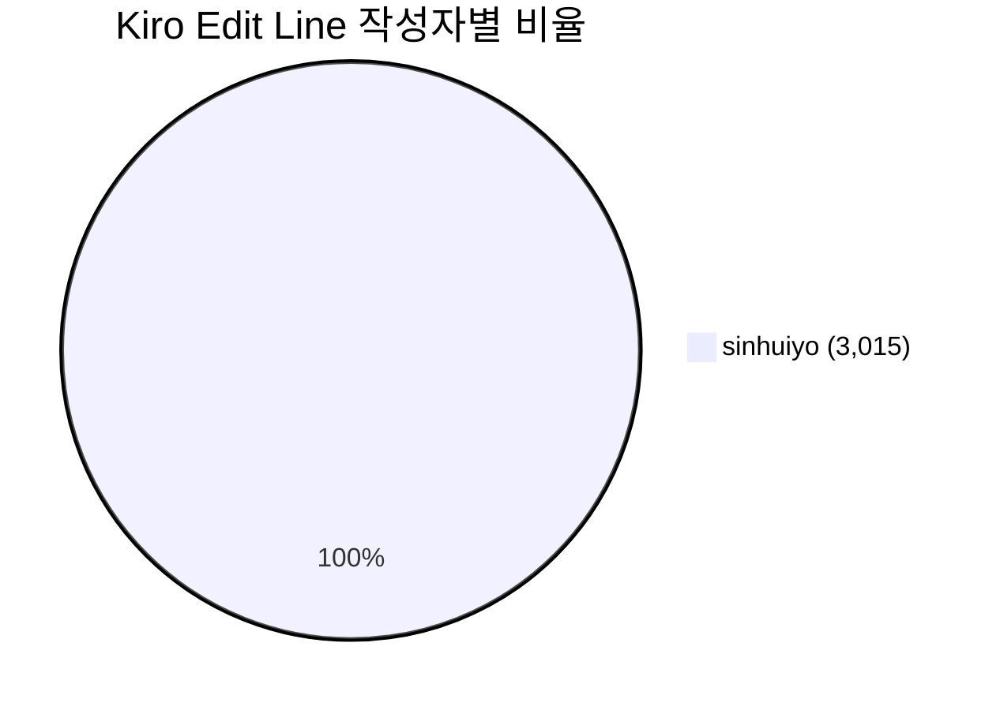
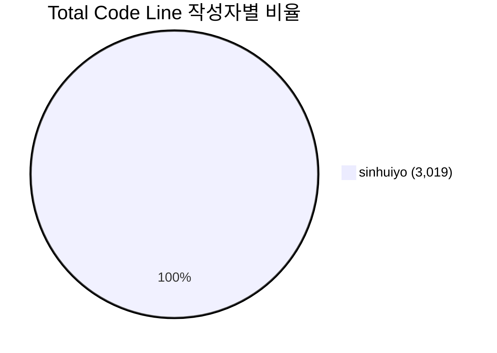

# Kiro 생성 코드 리포트

생성일: 2026-04-15

## 파일 목록

| 파일명 | 설명 | 작성자 | Kiro Edit Line | Total Code Line | 날짜 |
|--------|------|--------|---------------|-----------------|------|
| src/main/java/com/medialog/biz/BizApplication.java | Spring Boot 애플리케이션 메인 클래스. | sinhuiyo | 25 | 25 | 2026-04-14 |
| src/main/java/com/medialog/biz/bord/Board.java | 게시판 엔티티 (VO). | sinhuiyo | **60** | **64** | 2026-04-15 |
| src/main/java/com/medialog/biz/bord/BoardController.java | 게시판 REST 컨트롤러. | sinhuiyo | 152 | 152 | 2026-04-14 |
| src/main/java/com/medialog/biz/bord/BoardMailNotificationService.java | 게시판 메일 알림 서비스. | sinhuiyo | 72 | 72 | 2026-04-15 |
| src/main/java/com/medialog/biz/bord/BoardRepository.java | 게시판 리포지토리. | sinhuiyo | 25 | 25 | 2026-04-14 |
| src/main/java/com/medialog/biz/bord/BoardService.java | 게시판 서비스. | sinhuiyo | 162 | 162 | 2026-04-15 |
| src/main/java/com/medialog/biz/comm/FileUploadController.java | 파일 업로드/다운로드 REST 컨트롤러. | sinhuiyo | 104 | 104 | 2026-04-14 |
| src/main/java/com/medialog/biz/comm/FileUploadService.java | 파일 업로드 서비스. | sinhuiyo | 129 | 129 | 2026-04-14 |
| src/main/java/com/medialog/biz/comm/UploadFile.java | 업로드 파일 정보 엔티티 (VO). | sinhuiyo | 51 | 51 | 2026-04-14 |
| src/main/java/com/medialog/biz/comm/UploadFileRepository.java | 업로드 파일 리포지토리. | sinhuiyo | 14 | 14 | 2026-04-14 |
| src/main/java/com/medialog/biz/comm/WebConfig.java | 웹 설정. | sinhuiyo | 34 | 34 | 2026-04-14 |
| src/main/java/com/medialog/biz/lgin/LoginController.java | 로그인 REST 컨트롤러. | sinhuiyo | 105 | 105 | 2026-04-14 |
| src/main/java/com/medialog/biz/lgin/LoginService.java | 로그인 서비스. | sinhuiyo | 63 | 63 | 2026-04-15 |
| src/main/java/com/medialog/biz/mail/MailController.java | 폼메일 발송 REST 컨트롤러. | sinhuiyo | 56 | 56 | 2026-04-14 |
| src/main/java/com/medialog/biz/mail/MailNotificationService.java | 공통 메일 알림 서비스. | sinhuiyo | 95 | 95 | 2026-04-15 |
| src/main/java/com/medialog/biz/mail/MailRequest.java | 폼메일 요청 DTO (VO). | sinhuiyo | 36 | 36 | 2026-04-14 |
| src/main/java/com/medialog/biz/mail/MailService.java | 메일 발송 서비스. | sinhuiyo | 71 | 71 | 2026-04-14 |
| src/main/java/com/medialog/biz/main/HelloWorldController.java | HelloWorld REST 컨트롤러. | sinhuiyo | 40 | 40 | 2026-04-14 |
| src/main/java/com/medialog/biz/main/HelloWorldService.java | HelloWorld 서비스. | sinhuiyo | 27 | 27 | 2026-04-14 |
| src/main/java/com/medialog/biz/memb/Member.java | 회원 엔티티 (VO). | sinhuiyo | 72 | 72 | 2026-04-14 |
| src/main/java/com/medialog/biz/memb/MemberController.java | 회원 REST 컨트롤러. | sinhuiyo | 111 | 111 | 2026-04-14 |
| src/main/java/com/medialog/biz/memb/MemberRepository.java | 회원 리포지토리. | sinhuiyo | 28 | 28 | 2026-04-14 |
| src/main/java/com/medialog/biz/memb/MemberService.java | 회원 서비스. | sinhuiyo | 80 | 80 | 2026-04-14 |
| src/test/java/com/medialog/biz/BizApplicationTests.java | 애플리케이션 컨텍스트 로딩 테스트. | sinhuiyo | 21 | 21 | 2026-04-14 |
| src/test/java/com/medialog/biz/bord/BoardControllerTest.java | 게시판 컨트롤러 테스트. | sinhuiyo | 70 | 70 | 2026-04-14 |
| src/test/java/com/medialog/biz/bord/BoardMailNotificationServiceTest.java | 게시판 메일 알림 서비스 단위 테스트. | sinhuiyo | 120 | 120 | 2026-04-15 |
| src/test/java/com/medialog/biz/bord/BoardRepositoryTest.java | 게시판 리포지토리 테스트. | sinhuiyo | 90 | 90 | 2026-04-14 |
| src/test/java/com/medialog/biz/bord/BoardServiceTest.java | 게시판 서비스 테스트. | sinhuiyo | 181 | 181 | 2026-04-15 |
| src/test/java/com/medialog/biz/comm/FileUploadServiceTest.java | 파일 업로드 서비스 테스트. | sinhuiyo | 87 | 87 | 2026-04-14 |
| src/test/java/com/medialog/biz/comm/UploadFileRepositoryTest.java | 업로드 파일 리포지토리 테스트. | sinhuiyo | 58 | 58 | 2026-04-14 |
| src/test/java/com/medialog/biz/lgin/LoginControllerTest.java | 로그인 컨트롤러 단위 테스트. | sinhuiyo | 150 | 150 | 2026-04-14 |
| src/test/java/com/medialog/biz/lgin/LoginServiceTest.java | 로그인 서비스 단위 테스트. | sinhuiyo | 120 | 120 | 2026-04-15 |
| src/test/java/com/medialog/biz/mail/MailControllerTest.java | 메일 컨트롤러 테스트. | sinhuiyo | 60 | 60 | 2026-04-14 |
| src/test/java/com/medialog/biz/mail/MailNotificationServiceTest.java | 공통 메일 알림 서비스 단위 테스트. | sinhuiyo | 130 | 130 | 2026-04-15 |
| src/test/java/com/medialog/biz/mail/MailServiceTest.java | 메일 서비스 테스트. | sinhuiyo | 65 | 65 | 2026-04-14 |
| src/test/java/com/medialog/biz/main/HelloWorldControllerTest.java | HelloWorld 컨트롤러 테스트. | sinhuiyo | 38 | 38 | 2026-04-14 |
| src/test/java/com/medialog/biz/main/HelloWorldServiceTest.java | HelloWorld 서비스 테스트. | sinhuiyo | 28 | 28 | 2026-04-14 |
| src/test/java/com/medialog/biz/memb/MemberControllerTest.java | 회원 컨트롤러 단위 테스트. | sinhuiyo | 90 | 90 | 2026-04-14 |
| src/test/java/com/medialog/biz/memb/MemberServiceTest.java | 회원 서비스 단위 테스트. | sinhuiyo | 85 | 85 | 2026-04-14 |

---

Number of lines changed by Kiro : 3,015
Total number of lines : 3,019
AI 생성 비율 : 99.87 %

## 작성자별 Kiro Edit Line 비율

## 작성자별 Total Code Line 비율

